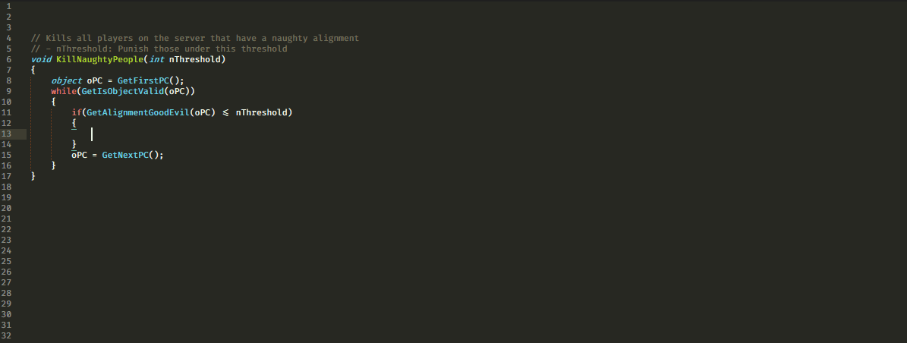

# Sublime Text completion and build tools for NWScript



# Features

- **NWScript**
    + **Syntax highlighting**: A bit more accurate than the C syntax
    + **Auto-completion**: Functions, constants, #define and include scripts
      names
    + **Documentation**: Popups containing function documentation parsed from
      the script, with some additional notes for known badly behaving
      functions.
    + **Snippets**: while loops with GetFirst / GetNext functions, and other
      useful code snippets
    + **Smart build tool**: Quick multi-threaded compilation (only re-compile
      needed scripts)
- **2DA syntax hilighting**: Syntax highlighting and label column indexing
  (<kbd>Ctrl+R</kbd>)

Note: This package has been designed for NWN2, but it should work with NWN1 as
well.

# Installation

## Compiler installation (required for using this package)

Chose **either** option 1 or 2

#### Option 1: Using the prepared zip (easy)
- Download and extract the [Packed
  NWNScriptCompiler](https://github.com/CromFr/STNeverwinterScript/releases/download/NWNScriptCompiler140705/NWNScriptCompiler.zip)
  in:
    - **Windows**: `C:\Program Files (x86)\`
    - **Linux**: `/opt/`


#### Option 2: Making your own compiler + scripts package

1. Download the AdvancedScriptCompiler
  (http://neverwintervault.org/project/nwn2/other/tool/advanced-script-compiler-nwn2)
  and extract content of `StandaloneCompiler` in
    + **Windows**: C:\Program Files (x86)\NWNScriptCompiler\
    + **Linux**: /opt/NWNScriptCompiler/
    + or any other path (see _Custom paths_ below)

2. Extract the NWN2 script data files (located by default in `C:\Program Files
  (x86)\Atari\Neverwinter Nights 2\Data\Scripts*.zip`) in
    - **Windows**: `C:\Program Files (x86)\NWNScriptCompiler\Scripts\`
    - **Linux**: `/opt/NWNScriptCompiler/Scripts`
    + or any other path (see _Custom paths_ below)

3. [Optional] You can delete ncs files from the `Scripts` directory, since only
   nss are required.

**Custom paths**: If you want to install the compiler somewhere else, you will
need to modify the package settings (_Preferences -> Package settings ->
STNeverwinterScript -> Settings_) to override the `compiler_cmd` and
`include_path` variables.

#### Extra steps for Linux
You need wine in order to use the NWNScriptCompiler.exe
```bash
apt-get install wine # Ubuntu/Debian users
yum install wine # Fedora/Redhat users
pacman -S wine # Arch-Linux awesome users
```

You also need to edit STNeverwinterScript settings (_Preferences -> Package
settings -> STNeverwinterScript -> Settings_) to override the `compiler_cmd`
and `include_path` variables for Linux (examples provided).


## Sublime package installation

#### Install with PackageControl
1. From Sublime Text: press <kbd>Ctrl+Shift+P</kbd>, write `PCInstall`, press <kbd>Enter</kbd>
2. Search for `STNeverwinterScript`, press <kbd>Enter</kbd>
3. Follow the [Compiler installation](#Compiler-installation) instruction
  above, if you haven't already
